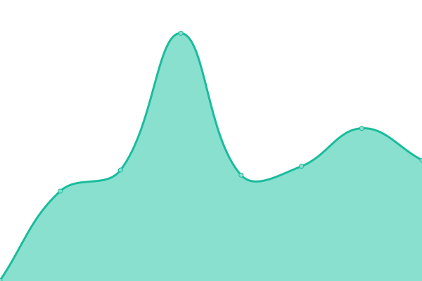

# [📈 Live Status](https://bajahaw.github.io/web-monitor): <!--live status--> **🟩 All systems operational**

This repository contains the open-source uptime monitor and status page for [Radhi](https://bajahaw.github.io/web-monitor), powered by [Upptime](https://github.com/upptime/upptime).

With [Upptime](https://upptime.js.org), you can get your own unlimited and free uptime monitor and status page, powered entirely by a GitHub repository. We use [Issues](https://github.com/bajahaw/web-monitor/issues) as incident reports, [Actions](https://github.com/bajahaw/web-monitor/actions) as uptime monitors, and [Pages](https://bajahaw.github.io/web-monitor) for the status page.

<!--start: status pages-->
<!-- This summary is generated by Upptime (https://github.com/upptime/upptime) -->
<!-- Do not edit this manually, your changes will be overwritten -->
<!-- prettier-ignore -->
| URL | Status | History | Response Time | Uptime |
| --- | ------ | ------- | ------------- | ------ |
|  [radhi.tech](https://www.radhi.tech) | 🟩 Up | [radhi-tech.yml](https://github.com/Bajahaw/web-monitor/commits/HEAD/history/radhi-tech.yml) | 

 409ms
     
 | 

<a href="https://status.radhi.tech/history/radhi-tech">99.16%</a>
    

|  [Portfolio](https://portfolio.radhi.tech) | 🟩 Up | [portfolio.yml](https://github.com/Bajahaw/web-monitor/commits/HEAD/history/portfolio.yml) | 

 408ms
     
 | 

<a href="https://status.radhi.tech/history/portfolio">92.82%</a>
    

|  [Backend infrastructure](https://backend.radhi.tech/api/health) | 🟩 Up | [backend-infrastructure.yml](https://github.com/Bajahaw/web-monitor/commits/HEAD/history/backend-infrastructure.yml) | 

 357ms
     
 | 

<a href="https://status.radhi.tech/history/backend-infrastructure">97.94%</a>
    

|  [Multi tic tac](https://multi-tic-tac.onrender.com) | 🟩 Up | [multi-tic-tac.yml](https://github.com/Bajahaw/web-monitor/commits/HEAD/history/multi-tic-tac.yml) | 

 6763ms
     
 | 

<a href="https://status.radhi.tech/history/multi-tic-tac">99.85%</a>
    

<!--end: status pages-->

[**Visit our status website →**](https://bajahaw.github.io/web-monitor)

## 📄 License

- Powered by: [Upptime](https://github.com/upptime/upptime)
- Code: [MIT](./LICENSE) © [Anand Chowdhary](https://anandchowdhary.com), supported by [Pabio](https://pabio.com)
- Data in the `./history` directory: [Open Database License](https://opendatacommons.org/licenses/odbl/1-0/)
